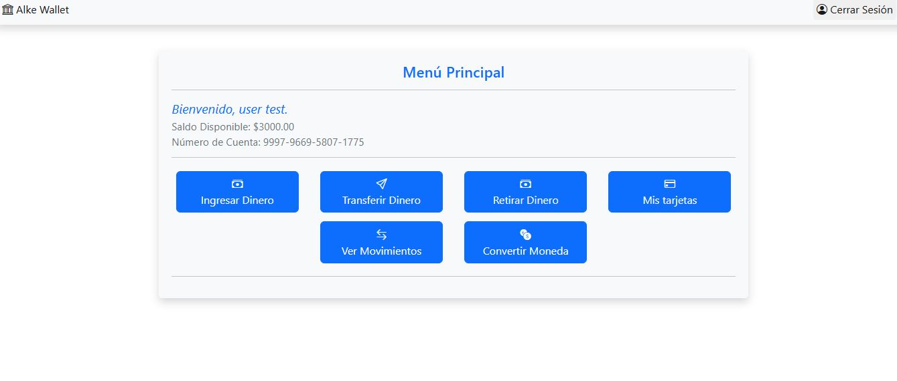
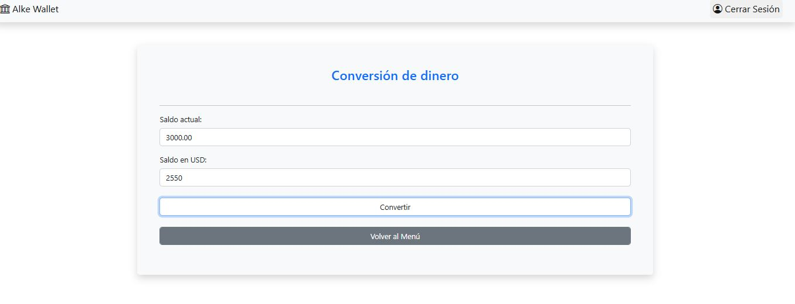
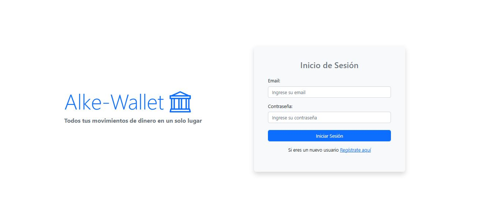
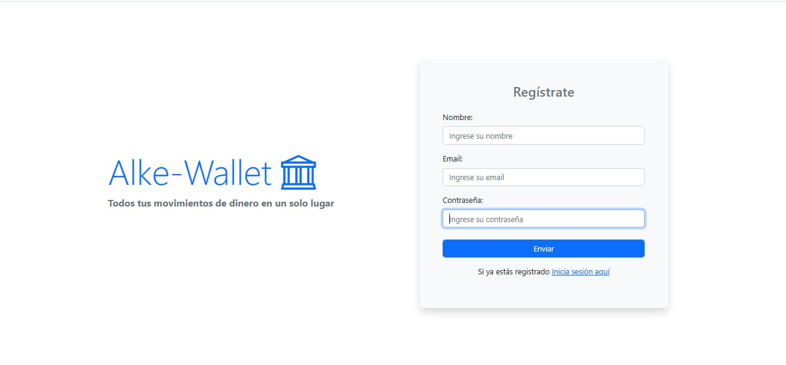
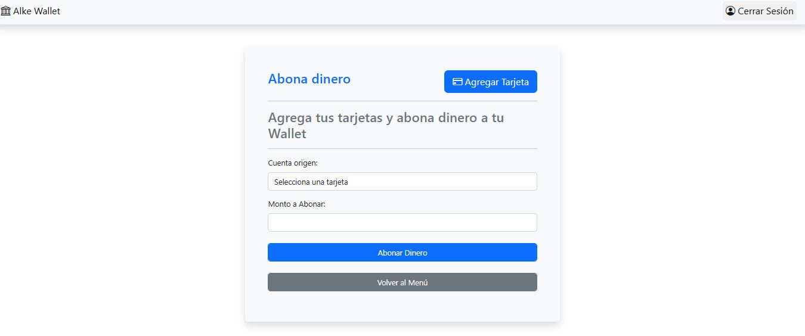
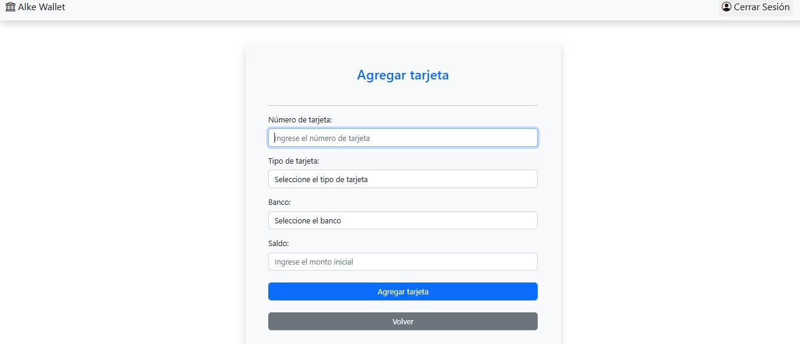
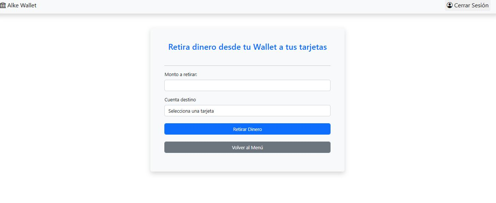
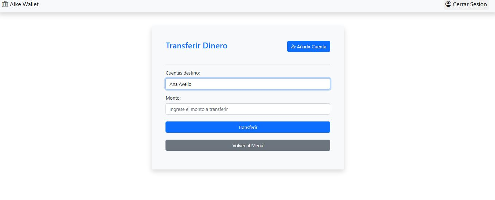
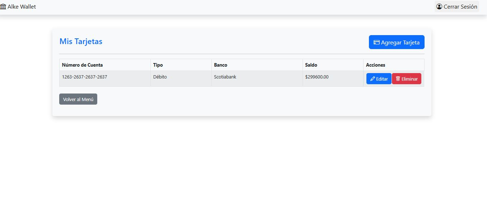
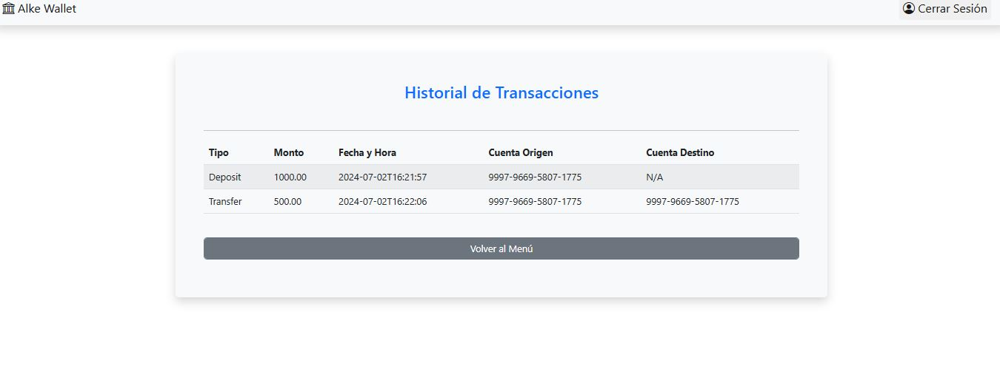

# AlkeWallet 2.0🚀

## Descripción

AlkeWallet es una aplicación de billetera digital 💸 que permite a los usuarios depositar dinero, transferir dinero a cuentas frecuentes, y revisar sus transacciones.

## Características

- **Depositar Dinero**: Los usuarios pueden depositar dinero en su billetera digital agregando tarjetas de crédito y/o débito.
- **Retirar Dinero**: Los usuarios pueden retirar dinero de su billetera digital a una cuenta bancaria.
- **Transferir Dinero**: Los usuarios pueden transferir dinero a cuentas alkeWallet frecuentes guardadas.
- **Revisar Transacciones**: Los usuarios pueden revisar todas sus transacciones.
- **Conversión de Moneda**: Los usuarios pueden convertir su dinero a diferentes monedas.(Se añade conversión de moneda en tiempo real a USD con jquery y ajax)

## Configuración y Ejecución

### Prerrequisitos

- Java 17
- Maven

### Instrucciones

1. Clona el repositorio:
   ```sh
   https://github.com/catherinefc21/modulo-6-alkeWallet.git
   ```
2. Entra al directorio del proyecto:
   ```sh
    cd modulo-6-alkeWallet
    ```
3. Crea una base de datos en MySQL llamada `alkewalletdb`.


4. En el archivo `application.properties` en `src/main/resources`, cambia el valor de `spring.datasource.username` y `spring.datasource.password` a tus credenciales de MySQL.


5. Ejecuta el siguiente comando para compilar el proyecto:
   ```sh
   mvn clean install
   ```
   
6. Ejecuta el siguiente comando para correr el proyecto:
   ```sh
    mvn spring-boot:run
    ```
   
7. Abre tu navegador y entra a `http://localhost:8080`.

8. Regístrate en la aplicación.

8. ¡Listo! Ya puedes empezar a usar AlkeWallet.

## Documentación endpoints

http://localhost:8080/swagger-ui/index.html

## App

### Menú

### Conversión de moneda

### Página de Inicio

### Registro

### Depositar Dinero


### Retirar Dinero

### Transferencias

### Mis Tarjetas

### Transacciones



